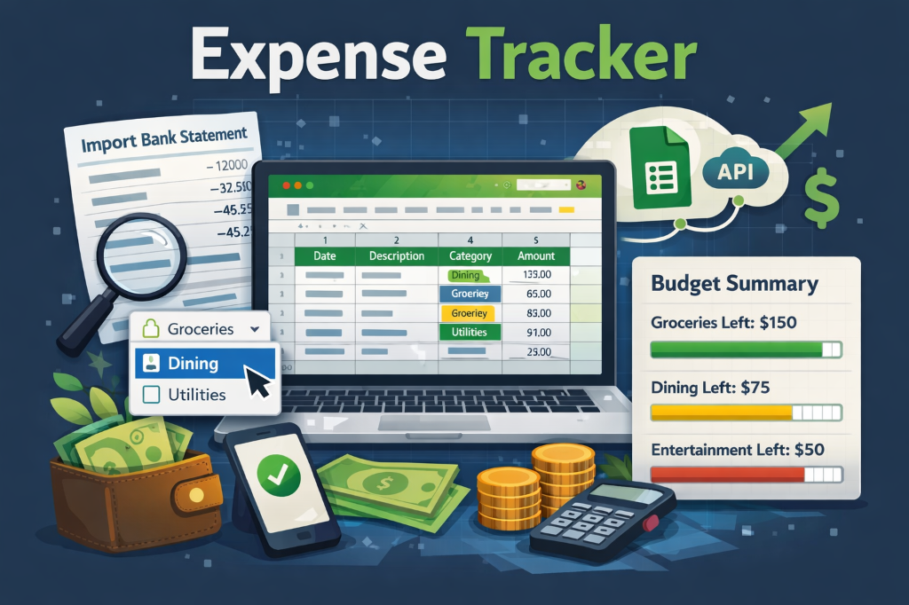

# Expense Tracker



A web-based bank statement extractor and expense categorization tool. Automatically syncs transactions to Google Sheets for easy budgeting.

## Features

- **PDF Extraction**: Drag & drop bank statements to extract transactions.
- **Auto-Categorization**: Learns from your previous tagging in Google Sheets.
- **Google Sheets Sync**: Sync categorized transactions directly to your personal finance sheet.
- **Secure**: Credentials managed via environment variables.

> [!NOTE]
> Currently, only **ICICI Bank** and **HDFC Bank** statement formats are supported.

## Setup

### Prerequisites

- Python 3.8+
- Node.js 16+
- Google Cloud Service Account with Google Sheets API enabled.

### 1. Environment Configuration

Copy the example environment file and fill in your Google Cloud credentials:

```bash
cp .env.example .env
```

Edit the `.env` file with your details.

### 2. Backend

```bash
# Install dependencies
pip install -r requirements.txt

# Run the server
python app.py
```

### 3. Frontend

```bash
cd frontend
npm install
npm run dev
```

## Configuration

New bank formats can be added by editing `bank_formats.json`.

## License

MIT
